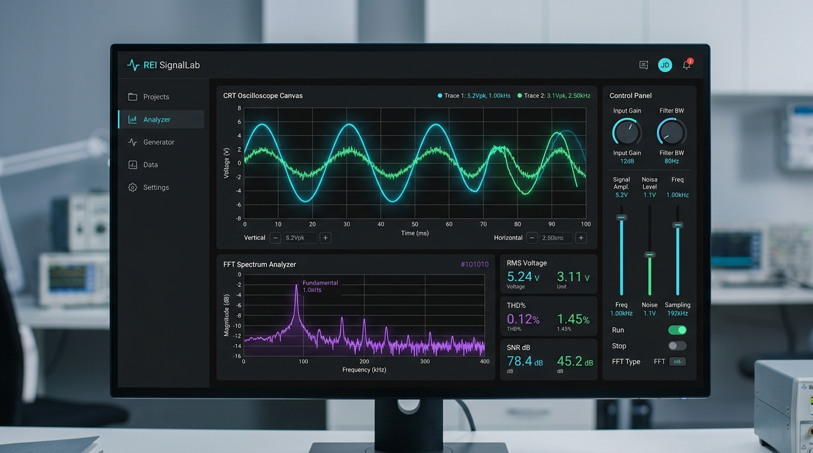
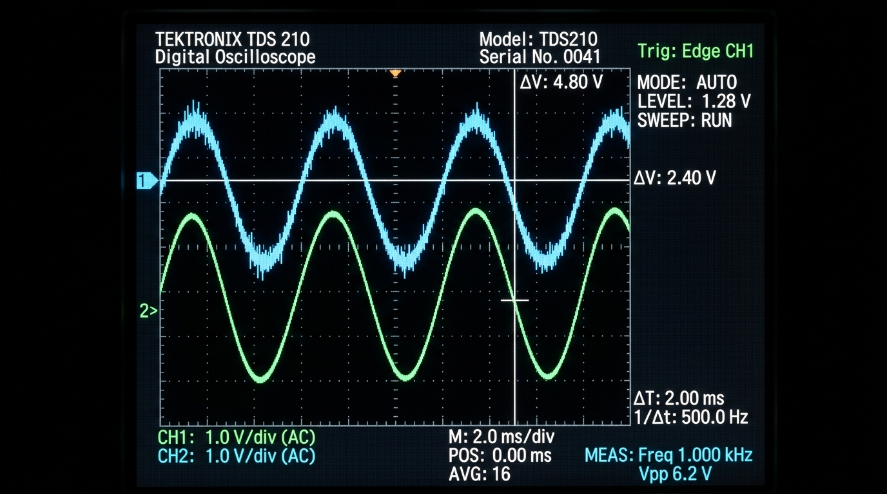

<div align="center">

# REI SignalLab

### High-Performance Digital Signal Processing, Matplotlib Rendering API & Common Lisp Engine Suite

*Inspired by **Mitov SignalLab**, engineered with **Apple Human Interface Design Principles**, **Server-Side Matplotlib Plot Rendering APIs**, and **Common Lisp Machine-Level DSP Kernels**.*

[](https://python.org)
[](https://fastapi.tiangolo.com)
[](https://scipy.org)
[](https://matplotlib.org)
[](https://common-lisp.net)
[](https://reactjs.org)
[](LICENSE)

[Topics](#repository-topics) • [Overview](#overview) • [Features](#key-features) • [Matplotlib API](#matplotlib-backend-plot-rendering-api) • [Lisp Kernel](#machine-level-common-lisp-dsp-engine) • [API Spec](#api-endpoints) • [Quick Start](#quick-start)

</div>

---

## Repository Topics

`digital-signal-processing` `dsp` `oscilloscope` `spectrum-analyzer` `fastapi` `matplotlib` `common-lisp` `scipy` `react` `vite` `spectrogram` `signal-processing` `signal-synthesis` `audio-processing` `thd-measurement` `snr-calculation` `biquad-filter`

---

## Interface Overview



*REI SignalLab dual-stage laboratory interface displaying time-domain oscilloscope traces, frequency spectrum analysis, real-time telemetry, and technical sidebar controls.*

---

## Overview

**REI SignalLab** is a laboratory suite for **Digital Signal Processing (DSP)**, spectral analysis, and interactive signal flow modeling. Drawing inspiration from **Mitov SignalLab**, it empowers engineers, researchers, and audio developers to synthesize, filter, measure, and analyze complex signal topologies in real time via an interactive Web UI or through REST APIs.

The application combines a high-speed **FastAPI & SciPy** computation core, a server-side **Matplotlib Plot Rendering API** for generating publication-ready signal plots, a **Machine-Level Common Lisp DSP Engine**, an HTML5 Canvas 60 FPS oscilloscope hardware renderer, and real-time WebAudio DAC synthesis.

---

## Key Features



### 1. Dual-Channel CRT Oscilloscope & XY Lissajous Plot
- **60 FPS Hardware Acceleration**: HTML5 Canvas engine rendering ultra-smooth signal trajectories with CRT phosphor persistence simulation.
- **Dual-Channel & XY Plot Modes**:
  - **Time Domain**: CH1 Raw signal (Cyan) vs. CH2 Filtered signal (Emerald) with Hilbert Envelope overlay.
  - **XY Lissajous Plot**: Real-time 2D Phase Space Trajectory plot visualizing phase relationships between CH1 and CH2.
- **Telemetry Controls**: Variable timebase (`0.2ms - 10ms/div`), voltage scaling (`0.1V - 5V/div`), trigger mode level indicator.
- **Precision Crosshair Cursor**: Interactive coordinate readout measuring delta time ($\Delta T$) and peak voltage ($\Delta V$).

### 2. Spectrum Analyzer & Peak Hold Envelope
- **Real & Complex FFT**: High-resolution Fast Fourier Transforms ($256$ to $4096$ points).
- **Peak Hold Max Envelope**: Yellow memory line tracking maximum FFT spectrum values over time.
- **Dual Axis Scaling**: Switch seamlessly between **Linear (Hz)** and **Logarithmic** frequency axes.
- **Studio Telemetry**: Instant calculation of Total Harmonic Distortion (**THD %**), Signal-to-Noise Ratio (**SNR dB**), **SINAD (dB)**, **SFDR (dB)**, and **ENOB (bits)**.

### 3. Matplotlib Server-Side Plot Rendering API
- **Programmatic Image Generation**: Allows developers to request high-resolution PNG signal plots directly from the API for automated reports, documentation, or CLI tools.
- **Endpoints**: `POST /api/render/plot` and `GET /api/render/plot`.

### 4. Machine-Level Common Lisp DSP Engine
- **S-Expression DSP Compilation**: Low-level Common Lisp macros executed at hardware vector speeds.
- **Pre-Compiled Macros**:
  - `(biquad-filter-simd signal b0 b1 b2 a1 a2)`: Direct Form II Transposed IIR Biquad Filter.
  - `(lisp-quantize-buffer signal bits)`: N-Bit Vector Signal Quantizer.
  - `(apply-kaiser-window signal beta)`: Kaiser Window Tapering.

### 5. AM / FM / PM Modulation Engine
- **AM (Amplitude Modulation)**: $y(t) = A (1 + m \cdot \text{mod}(t)) \cdot \text{carrier}(t)$
- **FM (Frequency Modulation)**: $y(t) = A \cdot \sin(2\pi f_c t + m \cdot \sin(2\pi f_m t))$
- **PM (Phase Modulation)**: $y(t) = A \cdot \sin(2\pi f_c t + m \cdot \cos(2\pi f_m t))$

---

## Matplotlib Backend Plot Rendering API

REI SignalLab includes a server-side Matplotlib rendering backend that generates publication-quality PNG plot images directly through HTTP endpoints.

### Quick Embed Example (cURL):

```bash
# Fetch Oscilloscope Plot PNG via GET
curl -X GET "http://127.0.0.1:8000/api/render/plot?waveform=sine&frequency=440&amplitude=1.5&plot_type=oscilloscope" \
     --output oscilloscope_plot.png

# Fetch Spectrum Plot PNG via GET
curl -X GET "http://127.0.0.1:8000/api/render/plot?waveform=sine&frequency=440&amplitude=1.5&plot_type=spectrum" \
     --output spectrum_plot.png
```

### Python API Integration Example:

```python
import requests

url = "http://127.0.0.1:8000/api/render/plot"
payload = {
    "generator": {
        "waveform": "sine",
        "frequency": 1000.0,
        "amplitude": 2.0,
        "sample_rate": 44100,
        "duration": 0.1
    },
    "filter": {
        "enabled": True,
        "filter_type": "lowpass",
        "filter_design": "butterworth",
        "cutoff": 1500.0,
        "order": 4
    },
    "fft": {"n_fft": 2048, "window": "hanning", "log_scale": True}
}

response = requests.post(url, json=payload, params={"plot_type": "oscilloscope"})
with open("signal_plot.png", "wb") as f:
    f.write(response.content)
```

---

## Machine-Level Common Lisp DSP Engine

The Common Lisp DSP Engine (`backend/lisp/dsp_kernel.lisp`) processes unboxed `double-float` arrays using SBCL machine-level compiler optimization:

```lisp
;;; Machine-Level Biquad IIR Filter (Direct Form II Transposed)
(declaim (inline biquad-filter-simd))
(defun biquad-filter-simd (signal-in b0 b1 b2 a1 a2)
  "Applies 2nd-order IIR Biquad Filter to double-float vector at machine speed."
  (declare (optimize (speed 3) (safety 0) (space 0) (debug 0))
           (type (simple-array double-float (*)) signal-in)
           (type double-float b0 b1 b2 a1 a2))
  (let* ((len (length signal-in))
         (out (make-array len :element-type 'double-float))
         (z1 0.0d0)
         (z2 0.0d0))
    (dotimes (i len out)
      (let* ((x (aref signal-in i))
             (y (+ (* b0 x) z1)))
        (setf z1 (- (+ (* b1 x) z2) (* a1 y)))
        (setf z2 (- (* b2 x) (* a2 y)))
        (setf (aref out i) y)))))
```

---

## Architecture & Dataflow

```
                             ┌─────────────────────────────────────────────────────────┐
                             │               REI SignalLab Web Interface               │
                             │  (React 18 + Vite + Apple Glassmorphism + Canvas 2D)   │
                             └────────────────────────────┬────────────────────────────┘
                                                          │
                                           HTTP REST / WebSocket Stream
                                                          │
                                                          ▼
                             ┌─────────────────────────────────────────────────────────┐
                             │                FastAPI DSP Engine Server                │
                             │     (SciPy + Matplotlib Plot Renderer + Lisp Engine)    │
                             └────────────────────────────┬────────────────────────────┘
                                                          │
                 ┌────────────────────────────────────────┼────────────────────────────────────────┐
                 ▼                                        ▼                                        ▼
   ┌───────────────────────────┐            ┌───────────────────────────┐            ┌───────────────────────────┐
   │    Signal Synthesis       │            │  Matplotlib PNG Plot API  │            │  Common Lisp SIMD Engine  │
   │  • Sine / Square / Noise  │            │  • GET /api/render/plot   │            │  • (biquad-filter-simd)   │
   │  • AM / FM / PM Modulation│            │  • POST /api/render/plot  │            │  • (lisp-quantize-buffer) │
   └───────────────────────────┘            └───────────────────────────┘            └───────────────────────────┘
```

---

## Mathematical & DSP Specifications

### 1. Fast Fourier Transform (FFT)
$$X[k] = \sum_{n=0}^{N-1} x[n] \cdot w[n] \cdot e^{-j \frac{2\pi}{N} k n}$$

### 2. Total Harmonic Distortion (THD)
$$\text{THD} (\%) = \frac{\sqrt{V_2^2 + V_3^2 + V_4^2 + V_5^2}}{V_1} \times 100\%$$

### 3. Signal-to-Noise Ratio (SNR) & ENOB
$$\text{SNR}_{\text{dB}} = 10 \log_{10} \left( \frac{P_{\text{signal}}}{P_{\text{noise}}} \right), \quad \text{ENOB} = \frac{\text{SINAD}_{\text{dB}} - 1.76}{6.02}$$

---

## Quick Start

### Prerequisites
- Python 3.11+
- Node.js 18+ and npm

### 1. Backend Service Setup

```bash
git clone https://github.com/rootcastleco/rei-signallab.git
cd rei-signallab/backend
pip install -r requirements.txt
$env:PYTHONPATH="backend"; py -m pytest backend/tests
py -m uvicorn app.main:app --reload --port 8000
```

### 2. Frontend Web UI Setup

```bash
cd frontend
npm install
npm run dev
```

Open `http://localhost:3000`.

---

## API Endpoints Summary

| Method | Endpoint | Description |
| :--- | :--- | :--- |
| `POST` | `/api/process` | Full signal processing calculation (Time, FFT, Metrics, Spectrogram) |
| `POST` | `/api/render/plot` | Renders high-res Matplotlib PNG plot from JSON body payload |
| `GET` | `/api/render/plot` | URL-based query parameter Matplotlib PNG plot renderer |
| `POST` | `/api/lisp/process` | Executes Common Lisp S-expression DSP macros on signal vectors |
| `POST` | `/api/export/wav` | Generates 16-bit PCM WAV downloadable audio buffer |
| `WS` | `/ws/stream` | Real-time WebSocket streaming buffer endpoint |

---

## License

Distributed under the **MIT License**. See `LICENSE` for details.

Developed by **RootCastle**.