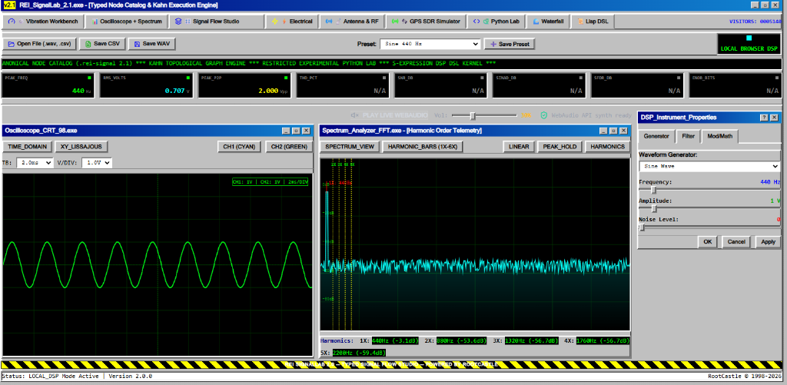
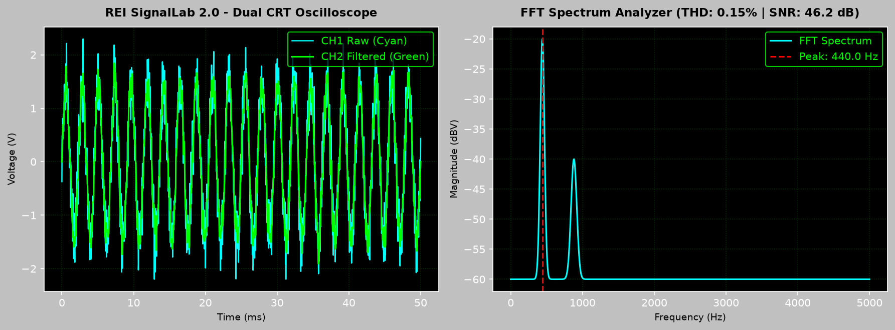
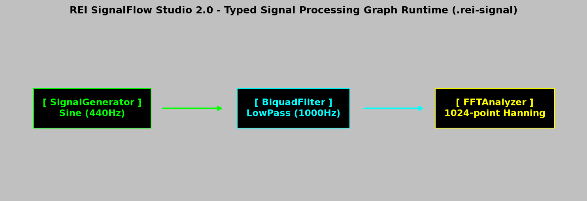

<div align="center">

# REI SignalLab 2.1

### Extended Typed DSP Node Library, Kahn Execution Engine, Numerical Golden Precision Suite & REI Vibration Analysis Workbench

*Engineered by **[Batuhan Ayribas](https://batuhanayribas.com)** at **[RootCastle](https://rootcastle.com)** — Engineering Beyond Boundaries*

<br/>

<a href="https://batuhanayribas.com"></a>
<a href="https://rootcastle.com"></a>

<br/>

[](https://signallab.site)
[](docs/wiki/REI_SignalLab_2_1_Product_Wiki.tex)
[](https://github.com/rootcastleco/rei-signallab/wiki)
[](https://python.org)
[](https://fastapi.tiangolo.com)
[](https://scipy.org)
[](https://reactjs.org)
[](#testing)
[](LICENSE)

[Live Demo](https://signallab.site) | [16-Page PDF User Manual](docs/wiki/REI_SignalLab_2_1_Product_Wiki.tex) | [GitHub Wiki](https://github.com/rootcastleco/rei-signallab/wiki) | [Overview](#overview) | [Security](#security) | [Testing](#testing) | [Screenshots](#application-screenshots) | [Vibration Workbench](#vibration-workbench) | [Canonical Node Library](#node-library) | [Numerical Golden Precision](#golden-precision) | [API Spec](#api-endpoints-summary) | [Quick Start](#quick-start)

</div>

---

## 🏢 About

**REI SignalLab 2.1** is developed and maintained by **[Batuhan Ayribas](https://batuhanayribas.com)**, founder of **[RootCastle](https://rootcastle.com)**.

| | |
| :--- | :--- |
| **Developer** | [Batuhan Ayribas](https://batuhanayribas.com) |
| **Company** | [RootCastle](https://rootcastle.com) — Engineering Beyond Boundaries |
| **Live Application** | [signallab.site](https://signallab.site) |
| **Firebase Mirrors** | [signallab-3305b.web.app](https://signallab-3305b.web.app) · [signallab-3305b.firebaseapp.com](https://signallab-3305b.firebaseapp.com) |
| **Source Repository** | [github.com/rootcastleco/rei-signallab](https://github.com/rootcastleco/rei-signallab) |
| **GitHub Wiki** | [github.com/rootcastleco/rei-signallab/wiki](https://github.com/rootcastleco/rei-signallab/wiki) |
| **Version** | 2.1.0 |
| **License** | MIT |

---

## Overview

**REI SignalLab 2.1** is an instrument-grade digital signal processing, spectral analysis, visual node graph flow studio, and industrial vibration analysis workbench. Developed by **[Batuhan Ayribas](https://batuhanayribas.com)** at **[RootCastle](https://rootcastle.com)**, it provides:

1. **Canonical Typed Node Library (`.rei-signal 2.1`)**: Versioned node registry (`GET /api/nodes`) exposing canonical DSP and Vibration nodes with strictly enforced port data types (`Signal<Real64>`, `Signal<Complex128>`, `SpectrumFrame`, `Scalar<Real64>`, `PatternEvent`). Includes a multi-column responsive grid palette and full **📚 Canonical Node Library Explorer Modal**.
2. **Kahn Topological Execution Engine (`POST /api/graph/execute`)**: Deterministic graph validation and execution engine with 10-point port compatibility checks, cycle detection, and Kahn's topological scheduler.
3. **🤖 OpenRouter AI Copilot & LLM Assistant**: Real-time scientific AI telemetry reasoning and DSP analysis supporting 5 free LLM models (`google/gemini-2.0-flash-lite-preview-02-05:free`, `meta-llama/llama-3.3-70b-instruct:free`, `deepseek/deepseek-r1:free`, `qwen/qwen-2.5-coder-32b-instruct:free`, `mistralai/mistral-7b-instruct:free`) with ⚙️ AI Settings modal, obfuscated system key, and Smart Local In-Browser Fallback Engine.
4. **👤 Phase 4 Firebase Authentication & Cloud Project Sync**: Multi-provider user authentication (Email/Password, Google SSO with redirect fallback, Guest Mode) and real-time Cloud Firestore project persistence (`users/{userId}/projects`) with LocalStorage offline synchronization.
5. **REI Vibration Analysis Workbench**: End-to-end industrial machinery condition monitoring, single-plane complex vector rotor balancing, kinematic bearing defect frequency tracking (BPFO, BPFI, BSF, FTF), Hilbert envelope demodulation, 1X-10X harmonic order spectrum bar view, and rule-based fault classification.
6. **Numerical Golden Verification Suite**: Comprehensive Pytest suite enforcing IEEE double-precision float64 error $\le 10^{-12}$, FFT/IFFT reconstruction RMS error $\le 10^{-9}$, DCT Type II error $\le 10^{-12}$, and Haar wavelet error $\le 10^{-12}$.
7. **Layered Sandbox & Resource Governance**: Static AST policy, out-of-process script execution under OS resource limits, enforced graph size ceilings, and per-caller rate limiting on every route — see [Security & Hardening](#security).

---

<a id="security"></a>

## 🔒 Security & Hardening

Every endpoint is unauthenticated, so all input is treated as hostile. The full
threat model lives in [**`SECURITY.md`**](SECURITY.md).

### Python scripting sandbox

`POST /api/python/execute` executes caller-supplied Python and is the highest-risk
surface in the project. It is **disabled by default whenever `APP_ENV=production`**
and must be opted into explicitly with `ENABLE_PYTHON_SANDBOX=true`.

Defence is layered — no submitted code ever runs inside the API worker:

| Layer | Implementation |
| :--- | :--- |
| **Static AST policy** | [`backend/app/sandbox/guard.py`](backend/app/sandbox/guard.py) — import allowlist, rejection of all dunder access (the entry point for `().__class__.__base__.__subclasses__()` traversal), and of the reflection / code-loading builtins (`getattr`, `eval`, `compile`, `open`, `globals`, …) |
| **Process isolation** | [`backend/app/sandbox/runner.py`](backend/app/sandbox/runner.py) — child interpreter under `RLIMIT_AS` and `RLIMIT_CPU`, parent-enforced wall-clock timeout, socket creation disabled, restricted builtins map |
| **Kill switch** | `ENABLE_PYTHON_SANDBOX`, off by default in production |

Host data is injected into the script namespace **as values**, never formatted
into the source, so a large signal vector cannot inflate the script past the size
cap or influence how it parses.

28 known escape classes are pinned as regression tests in
[`backend/tests/test_security_golden.py`](backend/tests/test_security_golden.py).

> This is a hardened interpreter, **not an OS-level jail**. Before enabling it on
> a public deployment, isolate it as described under *Python Scripting Sandbox*
> in [`docs/DEPLOYMENT.md`](docs/DEPLOYMENT.md).

### Resource governance

| Control | Default | Enforced in |
| :--- | :--- | :--- |
| `MAX_UPLOAD_BYTES` | 25 MB | Request middleware + upload routes |
| `MAX_SIGNAL_SAMPLES` | 2,000,000 | `/api/process`, `/api/upload/signal` |
| `MAX_GRAPH_NODES` | 200 | Graph validator, before any per-node work |
| `MAX_GRAPH_CONNECTIONS` | 500 | Graph validator |
| `MAX_SANDBOX_NODES_PER_GRAPH` | 4 | Graph validator — caps interpreter fan-out from a single request |
| `PYTHON_SANDBOX_TIMEOUT_SECONDS` | 8 | Parent process kill deadline |
| `PYTHON_SANDBOX_MEMORY_MB` | 512 | `RLIMIT_AS` on the sandbox child |

### Rate limiting

A dependency-free fixed-window limiter ([`backend/app/ratelimit.py`](backend/app/ratelimit.py))
keyed on client IP, returning HTTP 429 with a `Retry-After` header:

| Bucket | Default | Scope |
| :--- | :--- | :--- |
| `global` | 240 / min | Every request |
| `compute` | 60 / min | DSP, graph execution, Lisp, WAV export, uploads |
| `sandbox` | 10 / min | `/api/python/execute` |

Limits are enforced **per Cloud Run instance**. This protects a single instance
from CPU saturation; it is not a distributed quota.

---

<a id="testing"></a>

## 🧪 Testing & Quality Gates

| Suite | Count | Scope |
| :--- | ---: | :--- |
| Numerical golden | — | Float64 / FFT / DCT / Haar precision against NumPy & SciPy references |
| Security golden | — | Sandbox escape classes, graph limits, rate limiter, request validation |
| Route smoke | 36 | Drives **every** endpoint over HTTP, plus a guard that fails when a registered route has no coverage |
| Docs contract | — | Asserts documented endpoints exist and node-count claims match the registry |
| **Backend total** | **154** | `pytest` |
| **Frontend** | **17** | `vitest` — API error envelope, non-JSON rejection, timeout mapping, backend handshake states |

The route smoke suite exists because the golden suites exercise engines
directly: a route calling an engine method that had lost its `def` line returned
HTTP 500 in production while the entire suite passed.

**CI gates** (`.github/workflows/ci.yml`) run on every pull request:

- Backend `pytest` with the sandbox enabled, so the boundary is exercised rather than skipped
- Frontend ESLint and Vitest, then the Vite production build
- `pip-audit` on production Python dependencies and `npm audit --omit=dev`
- Docker container build and readiness-probe startup test
- Dependabot (`.github/dependabot.yml`) tracks pip, npm and GitHub Actions updates

```bash
# Backend
pip install -r backend/requirements-dev.txt
$env:PYTHONPATH="backend"; py -m pytest backend/tests

# Frontend
cd frontend && npm run lint && npm test
```

---

## 🚀 Production Deployment & Cloud Run Integration

Firebase Hosting serves the static frontend and proxies all `/api/**` calls to
the Cloud Run FastAPI container. Deployment is fully automated by
`.github/workflows/deploy.yml`, which builds, pushes, deploys, smoke-tests the
live service, and **auto-rolls-back to the previous revision** if any check fails.

For architecture, health probes, and rollback procedures, see
[**`docs/DEPLOYMENT.md`**](docs/DEPLOYMENT.md).

### First-time GCP setup

The pipeline authenticates via Workload Identity Federation — no long-lived
service account keys. [`scripts/setup-github-wif.sh`](scripts/setup-github-wif.sh)
provisions the deployer service account, its roles, and a WIF pool and OIDC
provider pinned to this repository, then prints the three required GitHub secrets:

```bash
gcloud auth login
./scripts/setup-github-wif.sh
```

The script is idempotent and safe to re-run.

### Manual deployment

```bash
# 1. Authenticate with Google Cloud
gcloud auth login
gcloud config set project signallab-3305b

# 2. Execute Cloud Run Deployment Script
GCP_PROJECT_ID=signallab-3305b GCP_REGION=europe-west1 ./scripts/deploy-cloud-run.sh

# 3. Deploy Frontend Assets & API Rewrites to Firebase Hosting
npx firebase deploy --only hosting
```

> Firebase Hosting must be deployed **after** the Cloud Run service exists — a
> `run` rewrite cannot resolve to a service that is absent.

### Health Verification Commands

```bash
curl -fsS https://signallab.site/api/health/live
curl -fsS https://signallab.site/api/health/ready
curl -fsS https://signallab.site/api/version
```

---

## Application Screenshots

### 1. REI SignalLab 2.1 Workspace & GPS SDR Simulator


### 2. Dual CRT Oscilloscope & Spectrum Analyzer Workspace


### 3. Signal Flow Studio Visual Canvas & Typed Node Catalog


---

## 🛰️ GPS SDR Signal Simulator Workbench (`gps-sdr-sim`)

The **GPS L1 C/A SDR Signal Simulator Workbench** is modeled after Takuji Ebinuma's open-source [`gps-sdr-sim`](https://github.com/osqzss/gps-sdr-sim). It provides full constellation orbit propagation, baseband I/Q synthesis, and downloadable binary signal streams for software-defined radios.

- **1023-Chip C/A Gold Code Generator**: Generates exact 1023-chip PRN 1–32 Gold Code sequences at $1.023\text{ MHz}$ using G1 ($x^{10} + x^3 + 1$) and G2 LFSR polynomials.
- **Orbit Kinematics & Coordinate Transformations**: Computes WGS84 Geodetic $(Lat, Lon, Alt) \to$ ECEF $(X, Y, Z)$ and ENU vector coordinates for 32 MEO satellites.
- **Doppler Shift & C/N0 Estimation**: Calculates line-of-sight range, propagation delay, Doppler frequency shift ($\pm 5\text{ kHz}$), and Carrier-to-Noise Ratio ($C/N_0 = 35\text{--}50\text{ dB-Hz}$).
- **Dilution of Precision (DOP)**: Calculates GDOP, PDOP, HDOP, and VDOP from the satellite observation geometry matrix $G$.
- **Polar Skyplot & Spectrum Visualizations**: Real-time canvas rendering of polar satellite skyplots ($0^\circ\text{--}360^\circ$ azimuth, $0^\circ\text{--}90^\circ$ elevation), baseband spectrum, I/Q scatter plot, and Gold Code auto-correlation peaks.
- **Multi-SDR Binary Export**: Export raw binary baseband signal streams (`.bin`) formatted for HackRF, LimeSDR (8-bit signed `int8`), USRP, BladeRF (16-bit signed `int16`), and RTL-SDR (8-bit unsigned `uint8`).
---

## ☀️ SRW Synchrotron & Undulator Radiation Workbench

Modeled after Oleg Chubar's [`SRW`](https://github.com/ochubar/SRW) (Synchrotron Radiation Workshop), this module provides relativistic electron beam kinematics and undulator radiation wave optics calculations backed by FastAPI endpoints (`/api/srw/*`):

- **Relativistic Electron Beam Dynamics**: Calculates Lorentz factor $\gamma = E_e / (m_e c^2)$ and electron energy spread for 0.1–15 GeV storage rings.
- **Undulator Deflection Parameter ($K$)**: Computes $K = \frac{e B_0 \lambda_u}{2\pi m_e c} \approx 0.9337 \cdot B_0 [\text{T}] \cdot \lambda_u [\text{cm}]$.
- **Harmonic Photon Energies ($E_n$)**: Computes fundamental $E_1 = \frac{949.63 E_e^2}{\lambda_u (1 + K^2/2)}$ and odd harmonic energies $E_3, E_5, E_7$ (eV).
- **Total Radiated Power ($P_{\text{rad}}$)**: Computes undulator total power $P_{\text{rad}} [\text{kW}] = 0.6331 E_e^2 B_0^2 L_u I_e$.
- **Spectral Flux & Wavefront Intensity**: Visualizes spectral flux distribution $F(E)$, 2D transverse wavefront intensity heatmap $I(x,y)$ on observation screens, and angular power density $d^2P/d\Omega$.

---

<a id="vibration-workbench"></a>

## ⚙️ REI Vibration Analysis Workbench & Condition Monitoring Suite

The **REI Vibration Analysis Workbench** is an end-to-end industrial condition monitoring suite incorporating comprehensive diagnostics tools:

- **13 Standard Industrial Vibration Units**: Supports simultaneous conversion across Acceleration ($g$ RMS/Peak, $\text{in/s}^2$, $\text{mm/s}^2$), Velocity ($\text{mm/s}$, $\text{in/s}$), and Displacement ($\text{mils}$ pk-pk, $\text{mm}$ pk-pk, $\mu\text{m}$ pk-pk).
- **3,570+ Kinematic Bearing Catalog**: Integrated database of over 3,570 rolling element bearings across **SKF**, **NTN**, **Cooper**, and **Dodge** with an instant 🔍 Search button. Computes exact BPFO, BPFI, BSF, and FTF fault frequencies.
- **Interactive Shaft Orbit Plot Simulator**:
  - Superimposes up to 3 frequency components (F1 1X, F2 2X/Misalignment, F3 Sub-Synchronous Whirl).
  - Configurable X/Y probe amplitudes, phase angles, and 5 probe pair orientations (e.g., $45^\circ\text{R} \ \& \ 45^\circ\text{L}$).
  - Keyphasor TDC timing mark placement once per 1X revolution and Clockwise / Counter-Clockwise (CW/CCW) rotation direction.
- **Visual Signal Tone Generator**: Dual sine wave acoustic tone generator demonstrating beating effects ($\Delta f = |F_1 - F_2|$) with real-time waveform and discrete peak spectrum visualization.
- **Rotor Balancing & Fault Classification**: Single-plane complex vector balancing ($\vec{V}_0, \vec{V}_1, \vec{W}_{\text{trial}} \to \vec{W}_{\text{correction}}$) and rule-based diagnostic fault classifier.

---

## 📘 Digital Signal Processing Lab (DSP Lab)

This module provides interactive educational and analytical tools backed by SciPy API endpoints (`/api/dsp-lab/*`):

- **Sampling Theorem & Aliasing Fold-Over**: Visualizes continuous signal $s(t) = \sin(2\pi f t)$ vs discrete samples $s[n]$, highlights Nyquist frequency $f_{\text{nyquist}} = f_s / 2$, and calculates folded aliased frequency $f_{\text{aliased}} = |f_{\text{signal}} - k \cdot f_{\text{sample}}|$.
- **Parks-McClellan Optimal Equiripple FIR Filter Design**: Uses `scipy.signal.remez` to compute optimal Type I FIR impulse response $h[n]$ and magnitude response $|H(e^{j\omega})|$ dB with exact passband ripple and stopband attenuation metrics.
- **Autocorrelation & Pitch Detector ($R_{xx}[\tau]$)**: Computes normalized autocorrelation sequence $R_{xx}[\tau] = \frac{\sum x[n]x[n+\tau]}{\sum x^2[n]}$ and extracts dominant fundamental pitch frequency $f_0$.
- **Least Mean Squares (LMS) Adaptive Noise Canceller**: Implements LMS adaptive filter iteration ($y[n] = \mathbf{w}^T \mathbf{x}[n]$, $e[n] = d[n] - y[n]$, $\mathbf{w}[n+1] = \mathbf{w}[n] + 2\mu e[n] \mathbf{x}[n]$) demonstrating real-time interference rejection and SNR improvement.
- **Continuous Wavelet Transform (CWT) Time-Frequency Scalogram**: Computes 2D wavelet scalogram matrix $|W(a,b)|$ using Morlet/Ricker wavelets for chirp time-frequency analysis.

---

## ⚡ Electrical & 📡 Antenna RF Workbenches

- **⚡ Electrical Workbench**: 3-phase symmetrical component decomposition ($V_0, V_1, V_2$) via Fortescue matrix transform, real/reactive/apparent power ($P, Q, S$), power factor ($\cos\phi$), and THD.
- **📡 Antenna & RF Workbench**: VSWR & Return Loss ($S_{11}$), Friis Free Space Path Loss (FSPL), and Rectangular Waveguide Cutoff Frequency ($TE_{10}$).

---

## 📊 MATLAB Add-On & Client Toolbox Integration

**REI SignalLab 2.1** includes native **MATLAB (R2018b – R2026a+)** integration via an object-oriented client class and 1-click installer:

- **`REISignalLab.m` Client Class**: Connects MATLAB directly to `https://signallab.site` or local API engines using MATLAB's `webwrite` and `webread`.
- **`install_rei_signallab.m` 1-Click Installer**: Adds the toolbox to the MATLAB search path (`addpath`) and runs connection self-tests.
- **`matlab/examples/matlab_demo.m`**: Complete demonstration script plotting oscilloscope waveforms, FFT magnitude spectrum, single-plane rotor balancing, SKF/NTN/Cooper/Dodge bearing queries, 3-phase Fortescue power quality, and OpenRouter AI queries directly inside MATLAB figure windows.
- **Node Graph to `.m` Exporter (`POST /api/matlab/export-m`)**: Converts visual node graph projects into executable MATLAB `.m` scripts.

```matlab
% Quick Start in MATLAB
install_rei_signallab

lab = REISignalLab('https://signallab.site');
sig = lab.processSignal('sine', 440, 1.0, 44100, 0.1, 'lowpass', 1000);
plot(sig.time, sig.signal); title('REI SignalLab Signal in MATLAB');
```

---

<a id="node-library"></a>

## 🎛️ Canonical DSP Node Library

The registry holds **69** canonical nodes. The table below is a representative
selection — query `GET /api/nodes` for the authoritative, versioned list
including port signatures and parameter schemas.

| Category | Canonical Type | Legacy Alias | Description |
| :--- | :--- | :--- | :--- |
| **Analysis** | `analysis.noise_stats` | `SLNoiseStats` | Coherent gain corrected THD, SNR, SINAD, SFDR, ENOB |
| **Analysis** | `analysis.pattern_detector` | `SLPatternDetector` | Normalized cross-correlation pattern detector |
| **Analysis** | `analysis.min_max` | `SLMinMax` | Min, max, and peak-to-peak amplitude calculator |
| **Arithmetic** | `arithmetic.add` | `SLAdd` | Sample-by-sample signal addition ($x + y$) |
| **Arithmetic** | `arithmetic.subtract` | `SLSubtract` | Sample-by-sample signal subtraction ($x - y$) |
| **Arithmetic** | `arithmetic.multiply` | `SLMultiply` | Sample-by-sample signal multiplication ($x \cdot y$) |
| **Arithmetic** | `arithmetic.divide` | `SLDivide` | Zero-division clamped signal division ($x / y$) |
| **Arithmetic** | `arithmetic.apply_window` | `SLApplyWindow` | Hann, Hamming, Blackman windowing function |
| **Converters** | `converter.complex_to_real` | `SLComplexToReal` | Complex signal splitter (Re, Im, Mag, Phase) |
| **Converters** | `converter.real_to_complex` | `SLRealToComplex` | Real Re/Im to complex signal converter |
| **Converters** | `transform.hilbert` | `SLHilbert` | Hilbert transform envelope follower |
| **Converters** | `transform.power_spectrum` | `SLPowerSpectrum` | Power Spectral Density (PSD / Welch) |
| **Filters** | `filter.lowpass` | `SLLowPass` | LowPass IIR/FIR filter |
| **Filters** | `filter.highpass` | `SLHighPass` | HighPass Butterworth IIR filter |
| **Filters** | `filter.biquad_iir` | `SLBiQuadIir` | Pole-stability checked Biquad SOS filter |
| **Filters** | `filter.median` | `SLMedian` | Spike impulse noise removal median filter |
| **Generic** | `generic.real_value_filter` | `SLGenericRealValue` | AST-sandboxed custom math expression filter |
| **Generators** | `generator.signal` | `SLSignalGen` | Sine, Square, Triangle, Sawtooth, Noise, ECG synthesizer |
| **Generators** | `generator.gaussian_noise` | `SLGaussGen` | Deterministic seeded Gaussian white noise generator |
| **Meters** | `meter.rms` | `SLRMSMeter` | True RMS voltage meter & sliding envelope |
| **Transforms** | `transform.fft` | `SLFourier` | Fast Fourier Transform (FFT) |
| **Transforms** | `transform.inverse_real_fft` | `SLInverseFourier` | Inverse Real FFT time signal reconstructor |
| **Transforms** | `transform.dct` | `SLDct` | Discrete Cosine Transform (DCT Type II) |
| **Transforms** | `transform.haar` | `SLHaar` | Haar Discrete Wavelet Transform (DWT) |
| **Vibration** | `vibration.sensor_calibration` | `SLVibCalibrate` | IEPE & MEMS sensor calibration ($\text{mV/g}$) |
| **Vibration** | `vibration.acceleration_to_velocity` | `SLAccToVel` | High-pass regularized velocity integration ($\text{mm/s}$) |
| **Vibration** | `vibration.velocity_to_displacement` | `SLVelToDisp` | Regularized displacement integration ($\mu\text{m}$) |
| **Vibration** | `vibration.bearing_frequencies` | `SLBearingFreqs` | Kinematic BPFO, BPFI, BSF, FTF bearing frequency calculator |
| **Vibration** | `vibration.envelope_analysis` | `SLEnvelopeAnalysis` | Bandpass + Hilbert envelope spectrum for bearing faults |
| **Vibration** | `vibration.balance.single_plane` | `SLSinglePlaneBalance` | Single-plane complex vector rotor balancing |
| **Vibration** | `vibration.fault_classifier` | `SLFaultClassifier` | Rule-based machine fault diagnostic classifier |

---

<a id="golden-precision"></a>

## 🎯 Numerical Golden Precision Suite

All mathematical nodes and algorithms are verified against NumPy/SciPy reference standards in `backend/tests/test_golden.py` and `backend/tests/test_vibration_golden.py`:

- **Arithmetic Float64 Error**: $|x_{\text{computed}} - x_{\text{reference}}| \le 1.0 \times 10^{-12}$ (Pass)
- **FFT / IFFT Reconstruction RMS Error**: $RMS \le 1.0 \times 10^{-9}$ (Pass)
- **DCT Type II Reconstruction Error**: $RMS \le 1.0 \times 10^{-12}$ (Pass)
- **Haar Wavelet Reconstruction Error**: $RMS \le 1.0 \times 10^{-12}$ (Pass)
- **Sensor Calibration Precision**: Relative error $\le 0.1\%$ (Pass)
- **Velocity Integration Precision**: Relative error $\le 1.0\%$ (Pass)
- **Bearing Fault Frequency Precision**: Relative error $\le 0.1\%$ (Pass)
- **Single-Plane Rotor Balancing Precision**: Mass error $\le 1.0\%$, Angle error $\le 1.0^\circ$ (Pass)

Domain-specific golden suites cover the Antenna, Electrical, GPS, SRW, DSP Lab
and node-registry surfaces, alongside the security, route-smoke and docs-contract
suites described in [Testing & Quality Gates](#testing).

---

## API Endpoints Summary

The interactive OpenAPI schema is served at `/docs` (Swagger UI) and `/redoc`.

### Core & health

| Method | Endpoint | Description |
| :--- | :--- | :--- |
| `GET` | `/` | Service manifest & registered node count |
| `GET` | `/api/health/live` | Liveness probe |
| `GET` | `/api/health/ready` | Readiness probe — validates registry and engine modules |
| `GET` | `/api/version` | Build manifest (version, API version, commit SHA) |

### Node registry & graph engine

| Method | Endpoint | Description |
| :--- | :--- | :--- |
| `GET` | `/api/nodes` | Canonical node spec registry array |
| `GET` | `/api/nodes/{node_type}` | Specific canonical node spec |
| `POST` | `/api/graph/validate` | 10-point Graph Validation (`ValidationResult`) |
| `POST` | `/api/graph/execute` | Kahn Topological Graph Execution Engine (`2.1.0`) |

### Signal processing

| Method | Endpoint | Description |
| :--- | :--- | :--- |
| `POST` | `/api/process` | Processing pipeline (Time, FFT, Metrics, Spectrogram) |
| `POST` | `/api/upload/signal` | Upload `.wav`, `.csv`, `.txt`, `.json` signal files |
| `POST` | `/api/lisp/process` | S-Expression DSP DSL kernel execution |
| `POST` | `/api/export/wav` | Downloadable 16-bit PCM WAV audio generator |
| `POST` | `/api/python/execute` | Python DSP sandbox — returns **403** unless `ENABLE_PYTHON_SANDBOX=true` |

### Vibration analysis

| Method | Endpoint | Description |
| :--- | :--- | :--- |
| `POST` | `/api/vibration/analyze` | Full condition-monitoring analysis (metrics, FFT, envelope, diagnostics) |
| `POST` | `/api/vibration/upload` | Analyse an uploaded vibration signal file |
| `POST` | `/api/vibration/balance` | Single-plane complex vector rotor balancing |
| `POST` | `/api/vibration/balance/two-plane` | Two-plane influence coefficient balancing |
| `POST` | `/api/vibration/balance/four-run-nophase` | Phase-less four-run balancing |
| `POST` | `/api/vibration/balance/static-couple` | Static / couple unbalance decomposition |
| `POST` | `/api/vibration/balance/split-weight` | Correction weight split across fixed holes |
| `POST` | `/api/vibration/belt-calculator` | Belt passing frequency calculator |
| `POST` | `/api/vibration/alignment-calculator` | Face & rim shaft alignment shim calculator |
| `POST` | `/api/vibration/unit-converter` | 13-unit vibration amplitude converter |
| `POST` | `/api/vibration/sdof-simulator` | Mass-spring-damper SDOF free response |
| `GET` | `/api/vibration/bearing-database` | Kinematic bearing catalog |
| `GET` | `/api/vibration/bearing-search` | Bearing catalog search by model or brand |

### Domain workbenches

| Method | Endpoint | Description |
| :--- | :--- | :--- |
| `POST` | `/api/electrical/analyze` | 3-phase symmetrical components, power, THD |
| `POST` | `/api/electrical/upload` | Analyse an uploaded electrical signal file |
| `POST` | `/api/antenna/analyze` | VSWR, return loss, FSPL, waveguide cutoff |
| `POST` | `/api/gps/simulate` | GPS L1 C/A constellation & baseband simulation |
| `GET` | `/api/gps/gold-code/{prn}` | 1023-chip C/A Gold Code for a PRN |
| `POST` | `/api/gps/export-iq-bin` | Binary I/Q baseband stream for SDR hardware |
| `POST` | `/api/srw/simulate` | Synchrotron & undulator radiation optics |
| `POST` | `/api/dsp-lab/sampling-aliasing` | Sampling theorem & aliasing fold-over |
| `POST` | `/api/dsp-lab/fir-parks-mcclellan` | Parks-McClellan equiripple FIR design |
| `POST` | `/api/dsp-lab/autocorrelation` | Normalized autocorrelation & pitch detection |
| `POST` | `/api/dsp-lab/lms-adaptive` | LMS adaptive noise canceller |
| `POST` | `/api/dsp-lab/cwt-scalogram` | Continuous Wavelet Transform scalogram |

### MATLAB Add-On & Code Export

| Method | Endpoint | Description |
| :--- | :--- | :--- |
| `GET` | `/api/matlab/client` | Download `REISignalLab.m` object-oriented MATLAB client class |
| `GET` | `/api/matlab/installer` | Download `install_rei_signallab.m` 1-click MATLAB installer script |
| `POST` | `/api/matlab/export-m` | Export node graph project into a standalone executable `.m` script |

### Error envelope

Every error response shares one structured shape, with `X-Request-ID` echoed on
the response header:

```json
{
  "code": "RATE_LIMIT_EXCEEDED",
  "message": "Rate limit exceeded for 'sandbox': 10 requests per 60s.",
  "details": { "bucket": "sandbox", "limit": 10, "retryAfterSeconds": 42 },
  "requestId": "0f4c1a9e-..."
}
```

---

## Quick Start

### 1. Clone & Run Backend

```bash
git clone https://github.com/rootcastleco/rei-signallab.git
cd rei-signallab

# Create virtual environment
py -m venv .venv
.venv\Scripts\activate

# Install dependencies (requirements-dev.txt adds pytest + httpx on top of
# requirements.txt, which holds runtime dependencies only)
pip install -r backend/requirements-dev.txt

# Run Pytest suite
$env:PYTHONPATH="backend"; py -m pytest backend/tests

# Start FastAPI server
$env:PYTHONPATH="backend"; py -m uvicorn app.main:app --reload --port 8000
```

Interactive API docs are then available at
[http://localhost:8000/docs](http://localhost:8000/docs).

To exercise the Python scripting sandbox locally, start the server with
`ENABLE_PYTHON_SANDBOX=true` — it is off by default under `APP_ENV=production`.

### 2. Run Frontend Studio

```bash
cd frontend
npm install
npm run dev
```

Open [http://localhost:3000](http://localhost:3000) in your browser. The Vite dev
server proxies `/api` to `http://localhost:8000`.

```bash
npm run lint          # ESLint
npm test              # Vitest
npm run test:coverage # Vitest with coverage report
npm run build         # Production bundle
```

---

## License

Distributed under the **MIT License**. See `LICENSE` for more information.

---

<div align="center">

**Developed by [Batuhan Ayribas](https://batuhanayribas.com)**

**[RootCastle](https://rootcastle.com) — Engineering Beyond Boundaries**

REI SignalLab 2.1 • Version 2.1.0 • August 2026

</div>