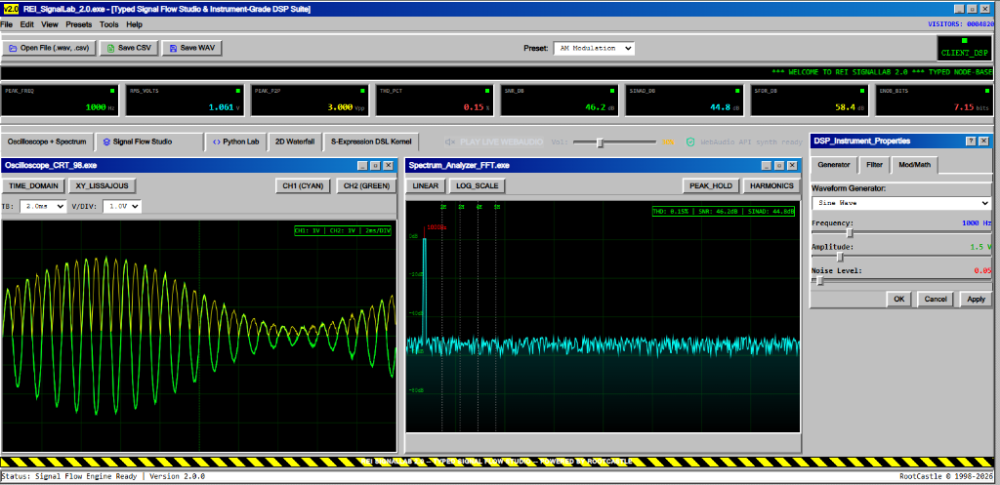
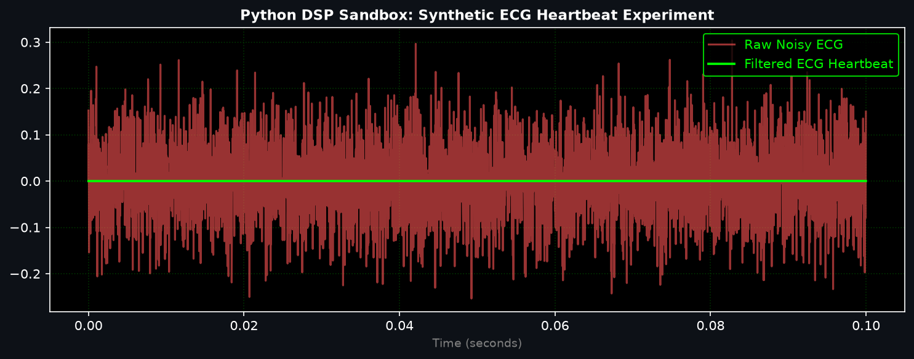

<div align="center">

# REI SignalLab 2.0

### Typed Node-Based Signal Flow Studio, Restricted Experimental Python Script Runner, Instrument-Grade DSP Engine & S-Expression DSL Kernel

*Inspired by **Mitov SignalLab**, engineered with **Typed Node Signal Flow Studio (`.rei-signal`)**, **Restricted Experimental Python Script Runner**, **Fail-Closed DSP Precision Engine**, and **S-Expression DSP DSL Kernel**.*

[](https://signallab-3305b.web.app)
[](https://python.org)
[](https://fastapi.tiangolo.com)
[](https://scipy.org)
[](https://matplotlib.org)
[](https://reactjs.org)
[](LICENSE)

[Live Demo](https://signallab-3305b.web.app) | [Overview](#overview) | [Screenshots](#application-screenshots) | [Signal Flow Studio](#1-typed-node-based-signal-flow-studio-rei-signal) | [Features](#key-features) | [API Spec](#api-endpoints-summary) | [Quick Start](#quick-start)

</div>

---

## 🚀 Live Application URL

- **Firebase Hosting App**: [**https://signallab-3305b.web.app**](https://signallab-3305b.web.app)
- **Firebase Mirror**: [**https://signallab-3305b.firebaseapp.com**](https://signallab-3305b.firebaseapp.com)
- **GitHub Repository**: [**https://github.com/rootcastleco/rei-signallab**](https://github.com/rootcastleco/rei-signallab)

---

## Overview

**REI SignalLab 2.0** is an instrument-grade laboratory suite for **Digital Signal Processing (DSP)**, spectral analysis, visual signal flow modeling, and Python signal code simulation. Drawing inspiration from **Mitov SignalLab**, it empowers engineers, researchers, and audio developers to synthesize, filter, measure, script, and visually compose complex signal topologies in real time via an interactive Web UI or through REST APIs.

The application combines a high-speed **FastAPI & SciPy** computation core, a **Typed Node-Based Signal Flow Studio (`.rei-signal`)**, a **Restricted Experimental Python Script Runner**, a server-side **Matplotlib Plot Rendering API**, an HTML5 Canvas 60 FPS oscilloscope hardware renderer, signal file upload (`.wav`, `.csv`, `.txt`, `.json`), and real-time WebAudio DAC synthesis.

---

## Application Screenshots

### 1. REI SignalLab 2.0 Application Main Interface


### 2. Dual CRT Oscilloscope & Spectrum Analyzer Workspace


### 3. Typed Signal Flow Studio (.rei-signal) Visual Canvas


### 4. Restricted Experimental Python DSP Code Sandbox & Matplotlib Plot Result


---

## Key 2.0 Features

### 1. Typed Node-Based Signal Flow Studio (`.rei-signal`)
- Visual interactive node graph workspace allowing users to visually compose signal processing pipelines:
  - **Sources**: `SignalGenerator`, `WAVSource`, `CSVReplay`
  - **Transforms / Filters**: `DCRemove`, `BiquadFilter`, `HilbertEnvelope`
  - **Analyzers**: `FFTAnalyzer`, `SpectrumAnalyzer`
  - **Outputs / Sinks**: `ScopeSink`, `CSVWriter`
- **Kahn's Topological Order & Cycle Detection**: Graph execution is topologically ordered using Kahn's Algorithm. Cycles are detected and rejected (`HTTP 422 GRAPH_CYCLE_DETECTED`).
- **Strict Port Type Validation**: Graph ports are strictly typed (`Signal<float32>`, `SpectrumFrame`, `Scalar`). Mismatched wiring (e.g. `SpectrumFrame → Signal<float32>`) is rejected (`HTTP 422 GRAPH_PORT_TYPE_MISMATCH`).
- **Reproducible Experiment Format (`.rei-signal`)**: Export & import versioned JSON project definitions (`formatVersion: "2.0"`).

### 2. Data Trust Boundary Separation
- **`[ API VERIFIED ]`**: Verified FastAPI/SciPy backend computed metrics.
- **`[ LOCAL BROWSER DSP ]`**: Real-time browser-side JavaScript/WebAudio computed FFT & RMS metrics.
- **`[ DEMO MODE ]`**: Displays mandatory warning banner: `⚠️ SIMULATED DEMO DATA - NOT FOR INSTRUMENT MEASUREMENT`.

### 3. Instrument-Grade Fail-Closed DSP Engine
- **No Silent Fallbacks**: If a filter design fails due to unstable poles, the engine throws an explicit error rather than silently returning unfiltered raw data.
- **Studio Telemetry**: Real-time calculation of Total Harmonic Distortion (**THD %**), Signal-to-Noise Ratio (**SNR dB**), **SINAD (dB)**, **SFDR (dB)**, and **ENOB (bits)**.

---

## API Endpoints Summary

| Method | Endpoint | Description |
| :--- | :--- | :--- |
| `GET` | `/` | Health check & 2.0 feature manifest |
| `POST` | `/api/graph/execute` | Executes typed Node-Based Signal Flow Graph (.rei-signal project) |
| `POST` | `/api/python/execute` | Executes user Python DSP scripts inside restricted runner |
| `POST` | `/api/upload/signal` | Uploads `.wav`, `.csv`, `.txt`, `.json` signal files for DSP processing |
| `POST` | `/api/process` | Full signal processing pipeline (Time, FFT, Metrics, Spectrogram) |
| `POST` | `/api/render/plot` | Matplotlib PNG plot from JSON request |
| `GET` | `/api/render/plot` | URL query parameter Matplotlib PNG plot renderer |
| `POST` | `/api/lisp/process` | Execute S-Expression DSP DSL macros on signal vectors |
| `POST` | `/api/export/wav` | Generate 16-bit PCM WAV downloadable audio buffer |
| `WS` | `/ws/stream` | Real-time WebSocket streaming buffer endpoint |

---

## Quick Start

### 1. Backend Setup

```bash
git clone https://github.com/rootcastleco/rei-signallab.git
cd rei-signallab/backend
pip install -r requirements.txt
```

Run test suite:

```bash
PYTHONPATH=backend pytest backend/tests
```

Start server:

```bash
PYTHONPATH=backend uvicorn app.main:app --port 8000
```

### 2. Frontend Setup

```bash
cd frontend
npm install
npm run dev
```

Open [http://localhost:3000](http://localhost:3000).

---

## License

Distributed under the **MIT License**. See `LICENSE` for details.

Developed by **RootCastle**.